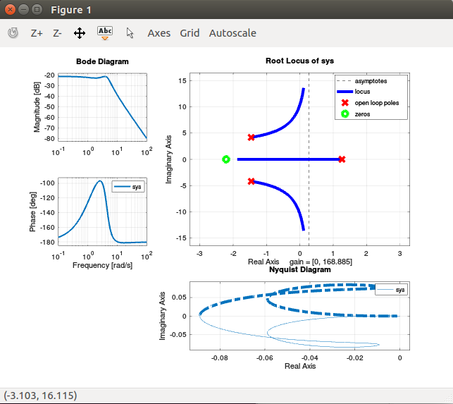

Concept Idea for SISO tool on Octave
====================================

This repository contains some code I am working on about the concept for sisotool on Octave.

It is based in the current rlocus code found in octave control package.

    
First you can download or clone it at:
 
   $ git clone git@github.com:EriveltonGualter/Concept-SISO-tool-for-Octave.git

Test code
=========

Run the MAIN.m file or in the current project folder type:

   $ MAIN

Illustration: https://youtu.be/VxosC6S3XK8

References
----------

- https://wiki.octave.org/Interactive_plots

IT IS JUST A PRELIMINARY WORK TO PROOF THE CONCEPT
